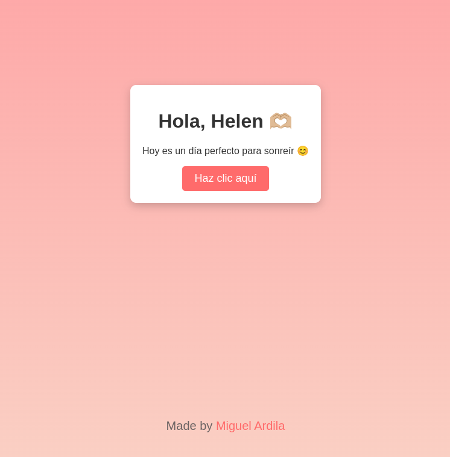

# 💌 **Click-Smile**

### 🌟 **Descripción**
Este proyecto fue creado con cariño para alegrar a una persona especial. Es una página interactiva donde, al hacer clic, se muestran mensajes motivadores y bonitos íconos que transmiten felicidad y esperanza.

---

### 🛠️ **Tecnologías utilizadas**
- **HTML5**: Estructura de la página.
- **CSS3**: Diseño visual y animaciones.
- **JavaScript**: Lógica interactiva para cambiar mensajes y animaciones.

---

### 🎯 **Características**
- Mensajes personalizados que cambian con cada clic.
- Animaciones de íconos (flores, corazones, etc.) para hacer la experiencia más divertida.
- Diseño atractivo con colores suaves y una interfaz centrada en la experiencia del usuario.

---

### 🖼️ **Vista previa**

  

 

---

### **✨ Inspiración**
El proyecto fue diseñado con la intención de transmitir felicidad y motivación a alguien especial, pero puede adaptarse para cualquier ocasión o persona.

### 💡 **Creador**
Creado con ❤️ por [Miguel Ardila](https://github.com/miguel-ardila).  
¡Si tienes alguna pregunta o sugerencia, no dudes en contactarme!